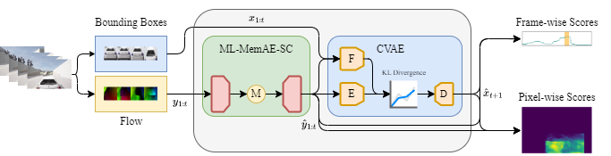

## HF2-VAD-AD
Official implementation of "Hybrid Video Anomaly Detection for Anomalous Scenarios in Autonomous Driving".


## One Semester Project Contents
docker hub(https://hub.docker.com/repository/docker/leolixingyou/hf2_vad_ad_test/general)
```bash
$ docker pull leolixingyou/hf2_vad_ad_test:finish
$ cd docker/
$ ./run_container_w_gpu.sh
```

Prepare data to download here [data/ckpt](https://drive.google.com/drive/folders/198S68h8G4KLKqTgnKdekEk_3HrrN1DRx?usp=sharing) in root folder as data and ckpt folder config.

and the zip file named **hf2vad_ad** is the full project file.


Run the code mentioned below.

All results, figures, and demo videos in the [results](https://github.com/leolixingyou/hf2vad_ad/tree/master/results) folder.

paper(https://arxiv.org/pdf/2406.06423)

## From Original Project


## 1. Dependencies
```
python==3.6
pytorch==1.5.1
mmcv-full==1.3.1
mmdet==2.11.0
scikit-learn==0.23.2
edflow==0.4.0
PyYAML==5.4.1
tensorboardX==2.4
```
## 2. Usage
### 2.1 Data preparation
Please follow the [instructions](https://github.com/daniel-bogdoll/hf2vad_ad/blob/master/pre_process/readme.md) to prepare the training and testing dataset.

### 2.2 Train
We train the ML-MemAE-SC at first, then train CVAE model with the reconstructed flows,
and finally finetune the whole framework. All the config files are located at `./cfgs`. 

To train the ML-MemAE-SC, run:
```python
$ python ml_memAE_sc_train.py
```
To train the CVAE model with reconstructed flows, run:
```python
$ python train.py
```
And finetune the whole HF2VAD-AD framework together as:
```python
$ python finetune.py
```
For different datasets, please modify the configuration files accordingly.

### 2.3 Evaluation
To evaluation the anomaly detection performance of the trained model, run:
```python
$ python eval.py [--model_save_path] [--cfg_file] 
```
E.g., for the Carla dataset:
```python
$ python eval.py \
         --model_save_path=./pretrained_ckpts/carla_local_best.pth \
         --cfg_file=./pretrained_ckpts/carla_local_best.yaml
```

## Acknowledgment
We thank LiUzHiAn for the PyTorch implementation of the [HF2VAD](https://github.com/LiUzHiAn/hf2vad).

## Citation

```

```
